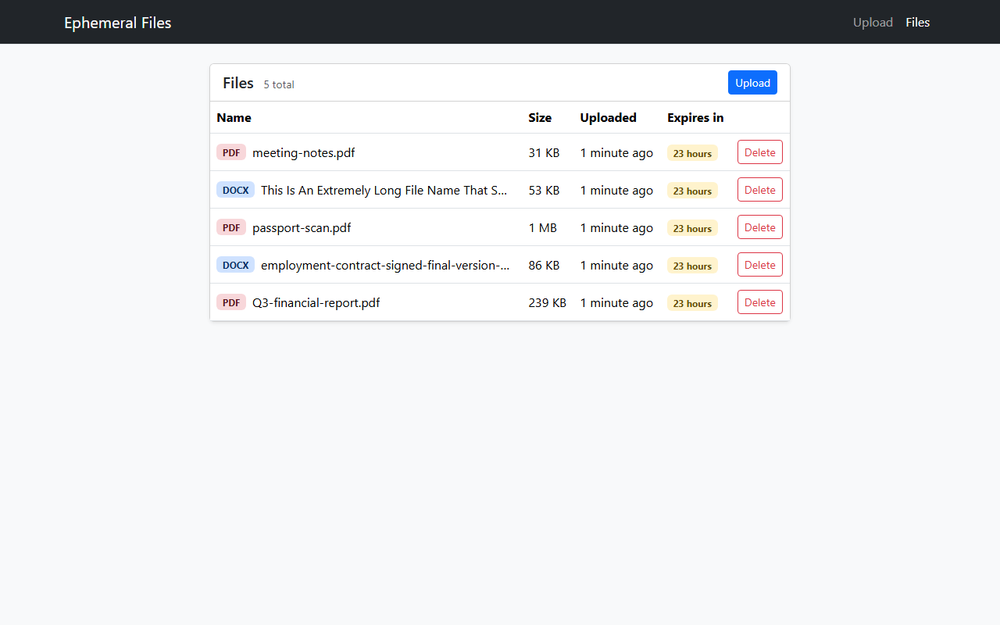
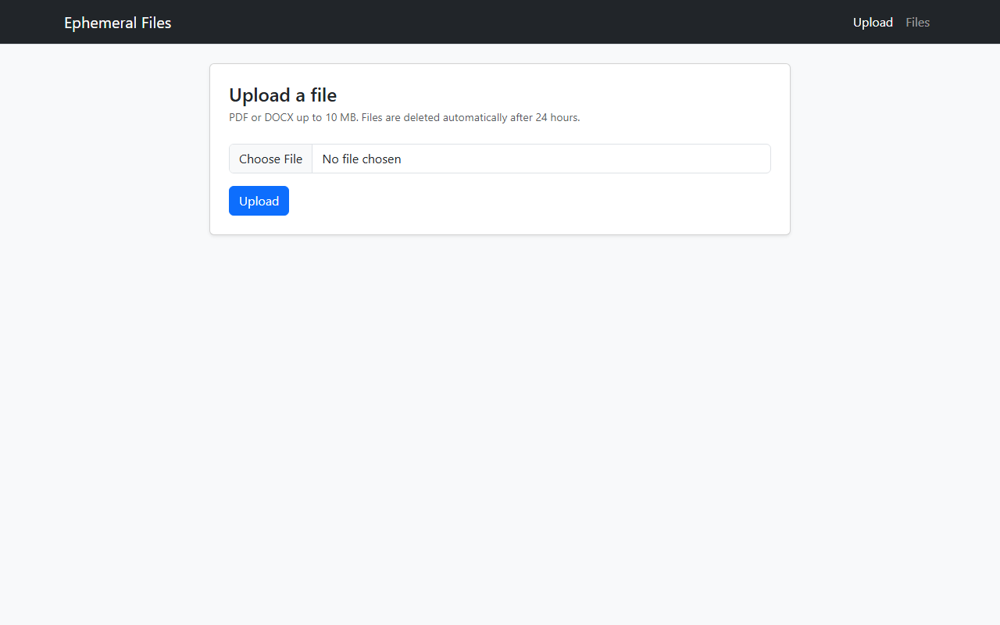
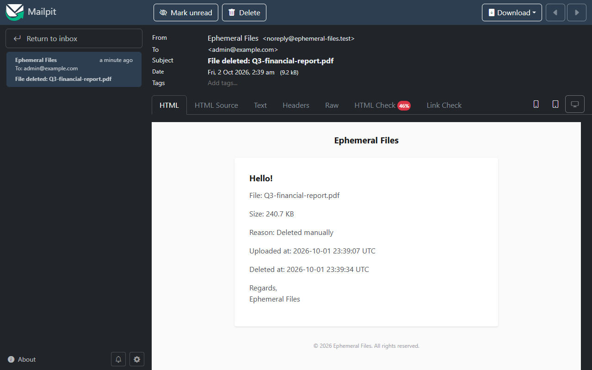

# Ephemeral Files

Temporary storage for PDF and DOCX files. Every file is deleted 24 hours after upload, and every deletion, manual or automatic, sends an email notice through RabbitMQ.

Laravel 13, PHP 8.4, MySQL 8.4, RabbitMQ 3, Bootstrap 5 + jQuery, Docker Compose.



## Quick start

Requires Docker with Compose v2. Nothing else on the host.

```bash
cp .env.example .env
docker compose up -d
```

The first start installs Composer dependencies, generates the app key and runs migrations inside the container, so it takes a few minutes (about 5 on a cold Linux machine). `docker compose ps` shows `app` as `healthy` when it is done.

| What | URL | Credentials |
|---|---|---|
| App, upload page | http://localhost:8080 | |
| App, file management | http://localhost:8080/files | |
| RabbitMQ management | http://localhost:15672 | guest / guest |
| Mailpit (caught emails) | http://localhost:8025 | |

On Linux, if your user id is not 1000, set `UID` and `GID` in `.env` to the output of `id -u` and `id -g` before the first start. The PHP containers run as that user so they can write to the mounted project directory. On Docker Desktop (Windows, macOS) this does not matter.

Ports are bound to `127.0.0.1` only. Change `APP_PORT` in `.env` if 8080 is taken.

## How to check it

1. Open http://localhost:8080 and upload a PDF or DOCX. The progress bar fills and the page does not reload.
2. Try a file over 10 MB, or a text file renamed to `.pdf`: you get a validation error.
3. Open http://localhost:8080/files. The file is listed with its expiry time. Delete it.
4. Open Mailpit at http://localhost:8025: there is an email to `NOTIFY_EMAIL` saying the file was deleted manually.

| Upload | Deletion notice |
|---|---|
|  |  |

**Automatic deletion without waiting 24 hours.** Set a short TTL in `.env`. The TTL is applied at upload time and php-fpm reads `.env` on every request, so no restart is needed:

```bash
FILE_TTL_MINUTES=1
```

Upload a file and wait about two minutes. The scheduler runs the purge every minute, the file disappears from `/files`, and Mailpit gets an email saying it expired. Files uploaded before the change keep their original expiry. The purge can also be run by hand:

```bash
docker compose exec app php artisan files:purge-expired
```

**Seeing the message in RabbitMQ.** Stop the worker, delete a file, and look at the queue:

```bash
docker compose stop queue-worker
```

The `default` queue at http://localhost:15672/#/queues holds one message and Mailpit gets nothing. Start the worker again and the email arrives:

```bash
docker compose start queue-worker
```

## Tests

```bash
docker compose exec app php artisan test
```

Feature tests run on SQLite in memory with notifications faked, so they need no broker. They cover upload validation (size boundary at exactly 10 MB, content type vs extension, DOCX detection), the management page, deletion through both paths, the TTL boundary, purge idempotency, the manual delete vs purge race, and the notification connection and recipient. Fixtures are real files: Laravel's `UploadedFile::fake()` guesses the mime type from the file name, which would make the content checks pass whatever the bytes are.

Code style: `docker compose exec app ./vendor/bin/pint --test`.

## Architecture

```
upload    browser --AJAX--> FileController@store --> StoreFileRequest --> FileUploadService --> private disk + stored_files row

manual    browser --AJAX--> FileController@destroy --.
                                                     |--> FileDeletionService --> RabbitMQ --> queue-worker --> mail (Mailpit)
expired   scheduler (every minute) --> files:purge-expired --'
```

Docker services: `app` (php-fpm), `nginx`, `mysql`, `rabbitmq`, `queue-worker` (`queue:work rabbitmq`), `scheduler` (`schedule:work`), `mailpit`.

Key decisions. The full list with rejected alternatives is in [docs/TASK.md](docs/TASK.md), the step plan in [docs/PLAN.md](docs/PLAN.md).

- **One deletion path.** The controller and the purge command both call `FileDeletionService::delete()`. Delete logic, notification and race handling live in one place.
- **Expiry is a sweep, not a delayed job.** `expires_at` is stored on upload and `files:purge-expired` runs every minute. A job delayed by 24 hours disappears if the queue is purged and is hard to test. The sweep is idempotent and the TTL is configurable with `FILE_TTL_MINUTES`.
- **The notice is published inside the delete transaction.** If RabbitMQ is down, the publish throws and the delete rolls back: the user sees an error, the purge retries a minute later, and no file is deleted without a notice. Publishing after commit would lose the notice in exactly that case.
- **Exactly one notice per file.** The delete is a conditional `DELETE ... WHERE id = ?`. When a manual delete and the purge hit the same file, the second one waits on the row lock, then deletes 0 rows and sends nothing.
- **The notification carries plain values.** The row no longer exists when the worker runs, so a serialized model could not be loaded back.
- **File type comes from content.** The detected type must be PDF or DOCX and must match the extension. Files are stored on a private disk under generated UUID names. Original names are only displayed, always escaped.
- **Size limit is enforced by Laravel.** nginx and PHP accept up to 12 MB, Laravel rejects above 10 MB with a JSON 422. Anything over 12 MB is cut by nginx with 413, which the upload page also handles.

## Trade-offs I would expect questions about

- **`FileType` uses static methods.** It is a pure function of the file bytes with no state and no I/O beyond reading the upload, so there is nothing to swap or mock. Tests run it on real files. If detection ever needed configuration or an external service, it would become an injected class.
- **Services use facades (`DB`, `Storage`, `Notification`) instead of injected contracts.** This is the Laravel default and the test fakes (`Storage::fake()`, `Notification::fake()`) cover them. Injecting `ConnectionInterface` and `Filesystem\Factory` would add constructor noise without changing what can be tested here.
- **No interfaces.** Every service has exactly one implementation. An interface per class would be ceremony; one can be extracted the day a second implementation exists.
- **Hard delete, no soft deletes.** The task says files are deleted. The notice carries everything worth keeping (name, size, reason, times), so a soft-deleted row would only be dead data.
- **RabbitMQ through a Laravel queue driver, not a hand-written publisher.** Retries, failed jobs and queued notifications come with the framework. The cost is that the driver does not use publisher confirms, so a message can in theory be lost in flight after the broker accepted the connection. That is far less likely than a broker outage, which is covered.
- **Publish inside the transaction holds a row lock for the duration of the publish.** That is a few milliseconds per file and only affects concurrent deletes of the same file, which is the race it is meant to serialise.
- **Expired files are removed within a minute of `expires_at`.** That is the scheduler granularity, and for a 24 hour retention it is 0.07%. A run with nothing to delete costs one indexed query on `expires_at`; when there is work, rows are processed in chunks of 100 with `chunkById`, so memory stays flat however many files expire at once. Running the purge every few seconds would add queries without making retention any more correct.
- **`APP_DEBUG=true` and `guest/guest` for RabbitMQ.** Local development defaults so the stack starts with one command. Ports are bound to `127.0.0.1`. A production setup would use real credentials and debug off.

## Known limits

- No authentication: anyone who can open the app can upload and delete. The task does not ask for users.
- If the process dies after the delete transaction commits but before the file is removed from disk, the file stays on disk without a row and nothing logs it. A periodic orphan cleanup would close this, it is left out of scope.
- `.env.example` has `APP_DEBUG=true`: this is a local development stack and error pages show stack traces.

## How AI was used

Built with Claude Code in a conductor setup: I approve the plan and every diff, an implementer agent writes code, separate QA and reviewer agents verify it without seeing each other's work. Prompts, agent definitions, findings and the places where the AI was wrong are in [AI_PROMPTS.md](AI_PROMPTS.md).
